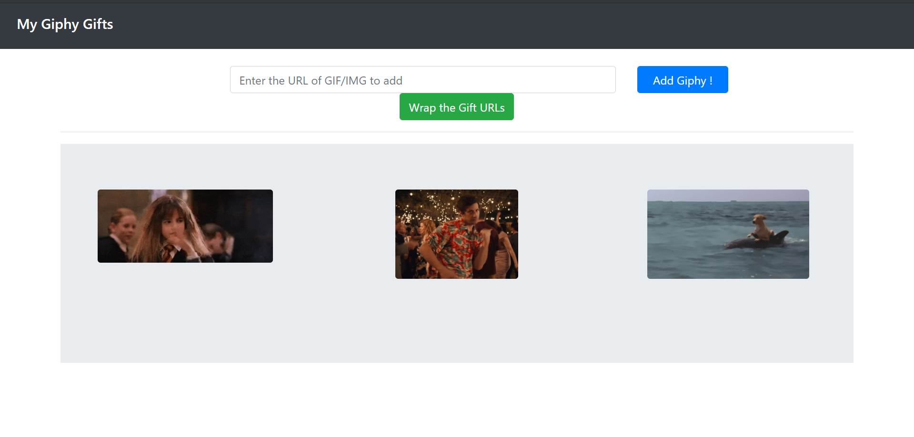
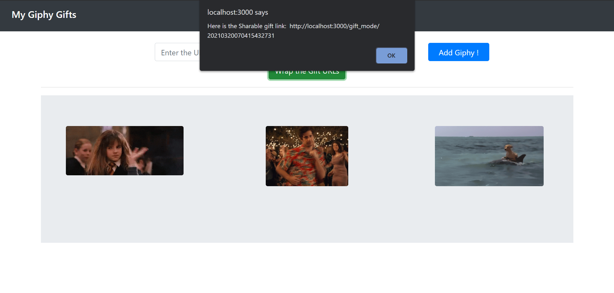
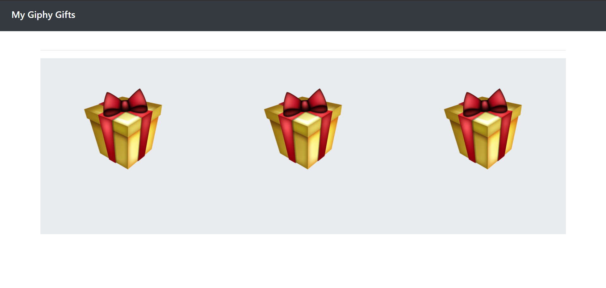
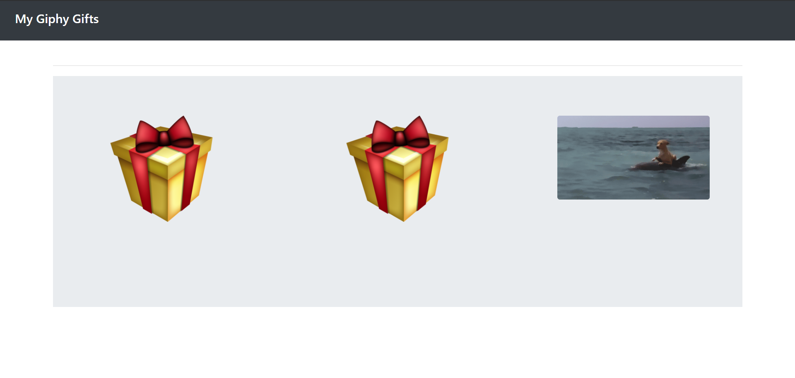
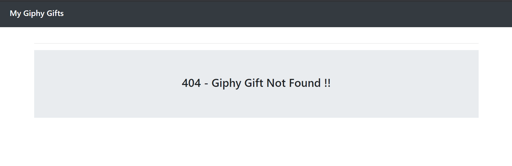

# Lets Learn ReactJS with GIFs :)
A simple application developed using ReactJS and FastAPI.
This web application can be used to collect multiple gifs
& wrap up into gift packs. After the gift Wrapping, it could get us a shareable link to share with our friends.

## Backend
- Python 3.8.5
- FastAPI
- Pydantic
- psycopg2 -- PostgreSQL 13

(check the pipefile for detailed info on the required packages -- install them using `pipenv install` after `cd <project_repo>`)

## Frontend
- ReactJS
- Axios
- React-Bootstrap

##### API Endpoints
- `[GET] ​/api​/gift_wrap​/{id}`
- `[DELETE] ​/api​/gift_wrap​/{id}`
- `[GET] ​/api​/all_gift_wrap​s`
- `[POST] ​/api​/gift_wrap​`

Swagger UI documentation will be available on running the application on

` [GET] /docs`

##### Ways to Improve:
- Proper Authentication - JWT (current the application doesnot have any authentication used)
- Adding a secure gift unwrap (using password to unwrap the gift so that the gift reaches only the authorised person)
- Update the ORM modals and the definition of the Scheme with the additional data as needed for the authentication system.
- UI/UX can be further improvised (gift wrap/unwrap animation, dashboard look etc).
- Middleware can be re-defined for making this an advanced application.

##### Application working screenshots

- Gifting Page  (add gif/img urls via this page)\

- Wrapping Gifts (On clicking wrap button, we get the sharable URL)\

- Shared Gift (this is how the shared gift URL looks on opening)\

- Unwrapping Gift (In the shared gift page, click on the gift wrapper to reveal the gif/img gift )\

- 404 Page (In case of incorrect/un-approved URL is accessed from client)

